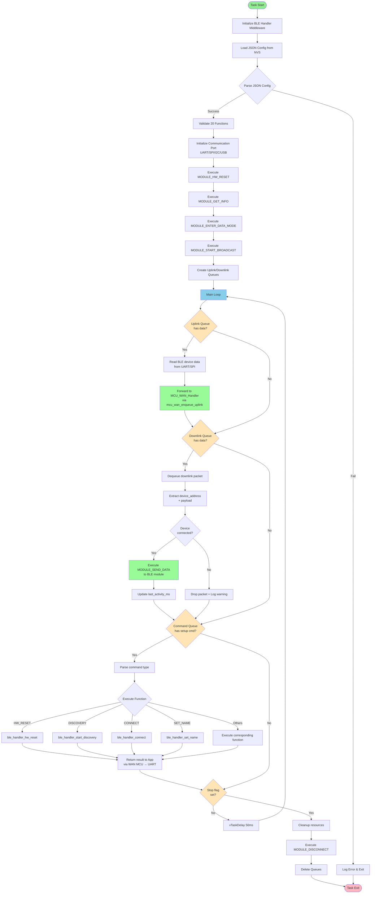

# Phase 3: BLE Handler Implementation Plan (Transportation Layer)

**Date:** February 7, 2026  
**Focus Module:** BLE (Bluetooth Low Energy) **as Transportation Gateway**  
**Future Modules:** Zigbee, LoRa, Thread (same transportation pattern)  
**Duration Estimate:** 5-7 days  
**Scope:** Implement **transparent BLE gateway** for bidirectional data flow between BLE devices and server

---

## Part 0: PC Config App Role

### PC App Workflow

The **PC Config App** (`config_app/main.py`) is responsible for:

1. **Configuration Generation**: Create JSON config file defining BLE module interface and 20 supported functions
2. **Function Mapping**: Define which MODULE_* functions the BLE module supports (via AT commands or API calls)
3. **Sequence Definition**: For each function, specify:
   - GPIO pre-sequences (e.g., reset, power control)
   - Command string to send to BLE module
   - Expected response pattern to validate success
   - GPIO post-sequences
   - Timeout values

4. **Gateway Provisioning**: Send JSON via serial/Ethernet to gateway
5. **Validation**: After gateway loads config, PC app can trigger discovery and verify device connection

### 20 Supported BLE Functions

**Mandatory Core (15 functions)** - All must be implemented for basic BLE transport:
- `MODULE_HW_RESET` - Hardware reset via GPIO
- `MODULE_SW_RESET` - Software reset via command
- `MODULE_FACTORY_RESET` - Factory reset (full config wipe)
- `MODULE_GET_INFO` - Get module version/info/MAC address
- `MODULE_SET_NAME` - Set advertising device name
- `MODULE_SET_COMM_CONFIG` - Configure UART/SPI/I2C/USB parameters
- `MODULE_SET_RF_PARAMS` - Set TX power, frequency, channel
- `MODULE_ENTER_CMD_MODE` - Enter AT command mode
- `MODULE_ENTER_DATA_MODE` - Enter transparent data forwarding mode
- `MODULE_START_BROADCAST` - Start advertising (BLE peripheral mode)
- `MODULE_CONNECT` - Connect to remote BLE device
- `MODULE_DISCONNECT` - Disconnect from remote device
- `MODULE_GET_CONNECTION_STATUS` - Check if connected, get signal strength
- `MODULE_ENTER_SLEEP` - Enter low-power mode
- `MODULE_WAKEUP` - Wake from sleep

**Promoted Optional (5 functions)** - PC App scan/send workflow; optional but recommended:
- `MODULE_START_DISCOVERY` - Scan for BLE devices in range (central mode)
- `MODULE_SEND_DATA` - Send data in transparent mode to remote device
- `MODULE_GET_DIAGNOSTICS` - Get RSSI, link quality, connection metrics
- `MODULE_SET_SECURITY` - Configure pairing/bonding/encryption
- `MODULE_MANAGE_WHITELIST` - Add/remove device MAC from whitelist

### JSON Schema for 20 Functions

```json
{
  "module_type": "BLE",
  "module_model": "HC-05",
  "communication": { ... },
  "functions": [
    {
      "function_name": "MODULE_HW_RESET",
      "gpio_start_control": [
        {"pin": "GPIO12", "state": "LOW"},
        {"pin": "GPIO12", "state": "HIGH"}
      ],
      "delay_start": 100,
      "command": "N/A",
      "expect_response": "",
      "timeout": 1000,
      "gpio_end_control": [],
      "delay_end": 500
    },
    {
      "function_name": "MODULE_START_DISCOVERY",
      "gpio_start_control": [],
      "delay_start": 0,
      "command": "AT+INQM=1,10,5",
      "expect_response": "OK",
      "timeout": 15000,
      "gpio_end_control": [],
      "delay_end": 0
    },
    ... (18 more functions)
  ]
}
```

### PC App → Gateway Flow

```
PC Config App
    ↓ (JSON config file)
Serial/Ethernet Connection
    ↓ (Upload JSON)
Gateway Config Handler
    ↓ (Parse & validate)
json_ble_config_parser
    ↓ (Map 20 functions)
Middleware ble_handler
    ↓ (Store function definitions)
Application ble_handler_task
    ↓ (Execute discovery/connect/send on demand)
BLE Module (hardware)
    ↓ (Radio communication)
BLE Devices (remote)
```

### PC App Test Sequence

```
1. PC sends JSON with 20 functions to gateway
2. Gateway parses and validates JSON
3. PC sends "execute MODULE_HW_RESET" command
4. Gateway resets BLE module via GPIO
5. PC sends "execute MODULE_ENTER_CMD_MODE" command
6. Gateway enters AT command mode
7. PC sends "execute MODULE_START_DISCOVERY" command
8. Gateway scans for BLE devices (e.g., 5 seconds)
9. PC sends "execute MODULE_CONNECT" with MAC address
10. Gateway connects to remote device
11. PC sends "execute MODULE_SEND_DATA" with payload
12. Gateway forwards data to remote device
13. Remote device responds (received as uplink)
14. PC receives uplink data via mcu_wan_enqueue_uplink(HANDLER_BLE, ...)
15. PC validates data integrity
```

---

## Part 0.5: System Data Flows & Function Mapping

### Overview: 5 System Data Flows

The BLE Handler operates within a larger system ecosystem with 5 distinct data flows. Each flow serves a specific purpose and utilizes specific functions from the 20-function set.

```
┌─────────────────────────────────────────────────────────────────────────┐
│                        SYSTEM ARCHITECTURE                              │
├─────────────────────────────────────────────────────────────────────────┤
│                                                                         │
│  PC App (Config Tool)                                                   │
│      ↓ Flow 1: Config JSON                                              │
│      ├─ UART ──→ WAN MCU ──QSPI──→ LAN MCU ──→ Parse & Apply Config   │
│      │                                                                  │
│  Sensor Devices                                                         │
│      ↓ Flow 2: Sensor Data                                              │
│      ├─ LAN MCU ──QSPI──→ WAN MCU ──MQTT──→ Cloud Server              │
│      │                                                                  │
│  Cloud Server                                                           │
│      ↓ Flow 3: Module Commands                                          │
│      ├─ Server ──MQTT──→ WAN MCU ──QSPI──→ LAN MCU ──→ Execute Cmd    │
│      │                                                                  │
│  PC App (Discovery)                                                     │
│      ↓ Flow 4: Device Discovery                                         │
│      ├─ UART ──→ WAN MCU ──QSPI──→ LAN MCU ──→ Scan & Return Results  │
│      │                                                                  │
│  PC App (Setup)                                                         │
│      ↓ Flow 5: Setup Commands                                           │
│      ├─ UART ──→ WAN MCU ──QSPI──→ LAN MCU ──→ Execute Setup & Return │
│                                                                         │
└─────────────────────────────────────────────────────────────────────────┘
```

### Detailed Flow Descriptions

#### **FLOW 1: Configuration JSON (Initialization)**

**Purpose:** Load BLE module configuration from PC app into LAN MCU
**Direction:** App → WAN MCU (UART) → LAN MCU (QSPI) → Module
**Trigger:** PC app sends JSON config file
**Task Responsibilities:** 
- LAN MCU: Parse JSON, validate function definitions, store in NVS
- Setup phase for all subsequent flows

**Functions Used in Flow 1:**
```
Core Setup Functions (used in initialization):
├─ MODULE_HW_RESET            ← Reset module to known state
├─ MODULE_SW_RESET            ← Fallback reset if HW reset fails
├─ MODULE_FACTORY_RESET       ← Clear all previous config
├─ MODULE_GET_INFO            ← Verify module type/version matches JSON
├─ MODULE_SET_COMM_CONFIG     ← Apply UART/SPI/I2C settings from JSON
├─ MODULE_SET_RF_PARAMS       ← Apply TX power/channel from JSON
├─ MODULE_ENTER_CMD_MODE      ← Prepare for config commands
└─ MODULE_ENTER_DATA_MODE     ← After config complete, enable transparent mode
```

**Sequence:**

```
┌─────────────────────────────────────────────────────────────────┐
│ FLOW 1: JSON CONFIG LOADING & INITIALIZATION                    │
└─────────────────────────────────────────────────────────────────┘

PC App                    WAN MCU              LAN MCU         BLE Module
    │                        │                    │                 │
    ├─ JSON (ASCII string) ──→ uart_handler       │                 │
    │                        │                    │                 │
    │                        ├─ QSPI Slave ─────→ Parse JSON        │
    │                        │                    │                 │
    │                        │                    ├─ Execute MODULE_HW_RESET ──→ [GPIO+CMD]
    │                        │                    │                 │ Reset GPIO HIGH
    │                        │                    │                 ├─ Reset (internal)
    │                        │                    │                 │
    │                        │                    ├─ Execute MODULE_GET_INFO ──→ AT+VER
    │                        │                    │                 ├─ Returns "JDY-23" (version)
    │                        │                    │
    │                        │                    ├─ Execute MODULE_SET_COMM_CONFIG ──→ AT+BAUD=9600
    │                        │                    │                 ├─ OK
    │                        │                    │
    │                        │                    ├─ Execute MODULE_SET_RF_PARAMS ──→ AT+POWR=8
    │                        │                    │                 ├─ OK (TX power set)
    │                        │                    │
    │                        │                    ├─ Execute MODULE_ENTER_DATA_MODE
    │                        │                    │                 ├─ Now ready for transparent data
    │                        │                    │
    │                        │  [CONFIG LOADED] ◄─── ACK
    │                        │                    
    │  [CONFIG APPLIED] ◄──────────── ACK ◄─────┘
    │
```

**Key Points:**
- JSON contains all 20 function definitions with GPIO sequences and AT commands
- If optional function not in JSON, handler skips it gracefully
- Module configuration stored in LAN MCU NVS for persistence
- Flow 1 execution happens ONCE at system startup

---

#### **FLOW 2: Sensor Data Uplink (Continuous)**

**Purpose:** Transport sensor data from local devices to cloud server
**Direction:** Sensor → LAN MCU (Local protocol) → WAN MCU (QSPI) → Server (MQTT/CoAP)
**Trigger:** Continuous sensor readings or event-based
**Task Responsibilities:**
- LAN MCU: Collect sensor data, queue to QSPI
- WAN MCU: Forward uplink to server via MQTT/HTTPS/CoAP

**Functions Used in Flow 2:**
```
Module Communication:
├─ MODULE_START_BROADCAST     ← Enable module to receive sensor data from remote BLE devices
├─ MODULE_ENTER_DATA_MODE     ← Transparent forwarding of sensor payloads
└─ MODULE_GET_CONNECTION_STATUS ← Verify device still connected
```

**Sequence:**

```
┌─────────────────────────────────────────────────────────────────┐
│ FLOW 2: SENSOR DATA UPLINK (Continuous)                         │
└─────────────────────────────────────────────────────────────────┘

BLE Device              BLE Module      LAN MCU            WAN MCU         Cloud
    │ Sensor Read            │             │                  │            │
    │ (temp=25.3°C)          │             │                  │            │
    │                        │             │                  │            │
    ├─ BLE TX ─────────────→ [Module]      │                  │            │
    │                        │ (transparent)                   │            │
    │                        ├─ UART data ─→ RX by LAN MCU    │            │
    │                        │   [device_addr|payload]        │            │
    │                        │             │                  │            │
    │                        │             ├─ Queue uplink    │            │
    │                        │             │   (HANDLER_BLE)  │            │
    │                        │             │                  │            │
    │                        │             ├─ DT frame ────→ QSPI Slave ──→ MQTT
    │                        │             │ [HANDLER_BLE|    │ publish    │
    │                        │             │  payload]        │            │
    │                        │             │                  ├─ Topic: /ble/device_addr/data
    │                        │             │                  │            │
    │                        │             │                  │            ├─ Stored in DB
    │                        │             │                  │            │
    │                        │             │  [ACK] ◄─────────┤ [Server received]
```

**Key Points:**
- Sensor data flows continuously through established BLE connections
- LAN MCU collects data and batches into QSPI frames
- WAN MCU processes and publishes to server
- No additional module commands needed (happens in data mode)

---

#### **FLOW 3: Module Control Commands (On-Demand)**

**Purpose:** Send control commands to BLE module based on server directives
**Direction:** Server (MQTT) → WAN MCU → LAN MCU (QSPI) → Module
**Trigger:** Server sends downlink MQTT message to specific BLE device
**Task Responsibilities:**
- WAN MCU: Receive MQTT downlink, forward to LAN MCU
- LAN MCU: Route to BLE module and send data

**Functions Used in Flow 3:**
```
Module Communication Commands:
├─ MODULE_SEND_DATA          ← Transmit control payload to connected BLE device
├─ MODULE_GET_CONNECTION_STATUS ← Verify target device still connected
├─ MODULE_DISCONNECT        ← Forcefully close connection if needed
└─ MODULE_START_BROADCAST   ← Re-enable advertising after disconnect
```

**Sequence:**

```
┌─────────────────────────────────────────────────────────────────┐
│ FLOW 3: MODULE CONTROL COMMANDS (On-Demand)                    │
└─────────────────────────────────────────────────────────────────┘

Cloud Server            WAN MCU           LAN MCU         BLE Module      Device
    │                      │                 │                │             │
    ├─ Control Cmd ───────→ MQTT Handler     │                │             │
    │ (e.g., turn on)      │ (downlink)      │                │             │
    │                      │                 │                │             │
    │                      ├─ Route to BLE ──→ Receive from   │             │
    │                      │ (via MCU_WAN)    │ MCU_WAN_Handler            │
    │                      │                 │                │             │
    │                      │                 ├─ Check connection           │
    │                      │                 │ (MODULE_GET_CONNECTION_STATUS)
    │                      │                 │ ──→ Query module ──→ [connected]
    │                      │                 │                │             │
    │                      │                 ├─ Execute MODULE_SEND_DATA   │
    │                      │                 │ Command: "AT+SEND=[payload]"│
    │                      │                 │                ├─ UART TX ──→ [BLE TX]
    │                      │                 │                │             │
    │                      │                 │                │             ├─ Actuator ON
    │                      │                 │                │             │
    │                      │                 │ ◄──────── [ACK] ◄──────────┤
    │                      │ ◄─────── [ACK] ◄┤
    │ ◄────────── [Status: OK] ◄──────────────┤
```

**Key Points:**
- Only executed if device is already connected
- Uses existing connection established in Flow 4 discovery
- Optional MODULE_DISCONNECT can gracefully close connection
- Supports multiple devices via device_address targeting

---

#### **FLOW 4: Device Discovery & Scanning (On-Demand)**

**Purpose:** Discover available BLE devices in range and return list to PC app
**Direction:** App → WAN MCU → LAN MCU → Scan Module → LAN MCU → WAN MCU → App
**Trigger:** PC app sends discovery request via UART
**Task Responsibilities:**
- LAN MCU: Execute discovery scan, collect results
- WAN MCU: Forward results back to app via UART
- Track discovered devices for future connection

**Functions Used in Flow 4:**
```
Discovery & Status Functions:
├─ MODULE_START_DISCOVERY    ← Scan for BLE devices in range (Central Mode)
├─ MODULE_GET_CONNECTION_STATUS ← Get RSSI, connection state
├─ MODULE_CONNECT           ← Establish connection with discovered device
├─ MODULE_GET_DIAGNOSTICS   ← Get RSSI, link quality (optional)
└─ MODULE_START_BROADCAST   ← For fallback if discovery fails
```

**Sequence:**

```
┌─────────────────────────────────────────────────────────────────┐
│ FLOW 4: DEVICE DISCOVERY & SCANNING (On-Demand)               │
└─────────────────────────────────────────────────────────────────┘

PC App                  WAN MCU           LAN MCU         BLE Module
    │                      │                 │                │
    ├─ Discovery Cmd ─────→ UART Handler     │                │
    │ (e.g., "scan 5s")    │                 │                │
    │                      │                 │                │
    │                      ├─ QSPI Request ──→ Parse Command   │
    │                      │                 │                │
    │                      │                 ├─ Execute MODULE_START_DISCOVERY
    │                      │                 │ Command: "AT+SCAN=5000"
    │                      │                 │ ──→ [BLE Radio]
    │                      │                 │                │
    │                      │                 │  [Scanning...] │
    │                      │                 │  └─ Device 1 found: AA:BB:CC:DD:EE:FF (RSSI: -45dBm)
    │                      │                 │  └─ Device 2 found: 11:22:33:44:55:66 (RSSI: -62dBm)
    │                      │                 │                │
    │                      │                 ├─ Execute MODULE_CONNECT (optional)
    │                      │                 │ "AT+LINK=AA:BB:CC:DD:EE:FF"
    │                      │                 │ ──→ [Establish connection]
    │                      │                 │ ◄─── Connected
    │                      │                 │
    │                      │ ◄─ QSPI Results ◄┤
    │                      │ (JSON: devices array)
    │                      │
    │ ◄──── Discovery Results ◄────── UART Response
    │ {
    │   "status": "success",
    │   "devices": [
    │     {"mac":"AA:BB:CC:DD:EE:FF", "rssi":-45, "name":"Device1"},
    │     {"mac":"11:22:33:44:55:66", "rssi":-62, "name":"Device2"}
    │   ]
    │ }
```

**Key Points:**
- MODULE_START_DISCOVERY scans for a defined duration (usually 5-10 seconds)
- Each discovered device returned with MAC address and RSSI (signal strength)
- PC app can then select a device and request connection (Flow 5)
- Results cached in LAN MCU for quick access
- Optional MODULE_GET_DIAGNOSTICS provides detailed link quality

---

#### **FLOW 5: Setup Commands (Configuration & Control)**

**Purpose:** Execute module-specific setup commands from PC app (reset, rename, config)
**Direction:** App → WAN MCU → LAN MCU → Module → LAN MCU → WAN MCU → App
**Trigger:** PC app sends setup command directly
**Task Responsibilities:**
- LAN MCU: Execute setup function and return results
- WAN MCU: Forward command and result back to app
- No automatic retries (app controls retry logic)

**Functions Used in Flow 5:**
```
Setup & Configuration Functions (Core - all should be executed):
├─ MODULE_HW_RESET          ← Hardware reset via GPIO (recovery)
├─ MODULE_SW_RESET          ← Software reset (faster, less disruptive)
├─ MODULE_FACTORY_RESET     ← Clear all config, full reset
├─ MODULE_GET_INFO          ← Query module version/MAC (verification)
├─ MODULE_SET_NAME          ← Rename device for identification
├─ MODULE_SET_COMM_CONFIG   ← Reconfigure UART/SPI/I2C parameters
├─ MODULE_SET_RF_PARAMS     ← Adjust TX power or other RF settings
├─ MODULE_ENTER_SLEEP       ← Power-save mode for battery devices
├─ MODULE_WAKEUP            ← Wake from sleep (GPIO pulse)
├─ MODULE_SET_SECURITY      ← Enable pairing/bonding/PIN (optional)
└─ MODULE_MANAGE_WHITELIST  ← Add/remove device MAC from whitelist (optional)
```

**Typical Setup Sequence (Example):**

```
┌─────────────────────────────────────────────────────────────────┐
│ FLOW 5: SETUP COMMANDS (Configuration & Control)               │
└─────────────────────────────────────────────────────────────────┘

PC App              WAN MCU           LAN MCU         BLE Module
    │                  │                 │                │
    │ Setup Cmd 1 ────→ UART Handler     │                │
    │ (HW_RESET)       │                 │                │
    │                  │                 │                │
    │                  ├─ QSPI ─────────→ Execute MODULE_HW_RESET
    │                  │                 │ (GPIO: LOW→delay→HIGH)
    │                  │                 │ ◄─────── Reset Complete
    │                  │ ◄─ [ACK] ◄──────┤
    │ ◄─ [Status OK] ──┤
    │
    │ Setup Cmd 2 ────→ UART Handler
    │ (SET_NAME)       │
    │                  │                 │
    │                  ├─ QSPI ─────────→ Execute MODULE_SET_NAME
    │                  │                 │ Command: "AT+NAME=GatewayBLE"
    │                  │                 │ ◄─────── OK
    │                  │ ◄─ [ACK] ◄──────┤
    │ ◄─ [Status OK] ──┤
    │
    │ Setup Cmd 3 ────→ UART Handler
    │ (SET_RF_PARAMS)  │
    │                  │                 │
    │                  ├─ QSPI ─────────→ Execute MODULE_SET_RF_PARAMS
    │                  │                 │ Command: "AT+POWR=8"
    │                  │                 │ ◄─────── OK (TX power set to 8dBm)
    │                  │ ◄─ [ACK] ◄──────┤
    │ ◄─ [Status OK] ──┤
    │
    │ Setup Cmd 4 ────→ UART Handler
    │ (GET_INFO)       │
    │                  │                 │
    │                  ├─ QSPI ─────────→ Execute MODULE_GET_INFO
    │                  │                 │ Command: "AT+VER"
    │                  │                 │ ◄─────── JDY-23 v2.1.0
    │                  │ ◄─ Result ◄─────┤
    │ ◄─ [Version Info] ◄─┤
```

**Key Points:**
- Each command executes synchronously (app waits for response)
- Timeout specified per function in JSON (usually 500-2000ms)
- GPIO sequences execute before and after AT command
- Graceful error handling if module doesn't respond
- Optional functions (SECURITY, WHITELIST) execute same way

---

### Function Classification Matrix

```
┌──────────────────────────────────┬─────────┬────────┬────────┬────────┬────────┐
│ Module Function                  │ Flow 1  │ Flow 2 │ Flow 3 │ Flow 4 │ Flow 5 │
│                                  │ Config  │ Sensor │ Control│ Discov │ Setup  │
├──────────────────────────────────┼─────────┼────────┼────────┼────────┼────────┤
│ MODULE_HW_RESET                  │    ✓    │        │        │        │   ✓    │
│ MODULE_SW_RESET                  │    ✓    │        │        │        │   ✓    │
│ MODULE_FACTORY_RESET             │    ✓    │        │        │        │   ✓    │
│ MODULE_GET_INFO                  │    ✓    │        │        │        │   ✓    │
│ MODULE_SET_NAME                  │    ✓    │        │        │        │   ✓    │
│ MODULE_SET_COMM_CONFIG           │    ✓    │        │        │        │   ✓    │
│ MODULE_SET_RF_PARAMS             │    ✓    │        │        │        │   ✓    │
│ MODULE_ENTER_CMD_MODE            │    ✓    │        │        │        │        │
│ MODULE_ENTER_DATA_MODE           │    ✓    │   ✓    │        │        │        │
│ MODULE_START_BROADCAST           │    ✓    │   ✓    │   ✓    │   ✓    │        │
│ MODULE_CONNECT                   │        │        │        │   ✓    │        │
│ MODULE_DISCONNECT                │        │        │   ✓    │   ✓    │        │
│ MODULE_GET_CONNECTION_STATUS     │        │   ✓    │   ✓    │   ✓    │        │
│ MODULE_ENTER_SLEEP               │        │        │        │        │   ✓    │
│ MODULE_WAKEUP                    │        │        │        │        │   ✓    │
│ MODULE_START_DISCOVERY (opt)     │        │        │        │   ✓    │        │
│ MODULE_SEND_DATA (opt)           │        │   ✓    │   ✓    │        │        │
│ MODULE_GET_DIAGNOSTICS (opt)     │        │   ✓    │   ✓    │   ✓    │        │
│ MODULE_SET_SECURITY (opt)        │    ✓    │        │        │        │   ✓    │
│ MODULE_MANAGE_WHITELIST (opt)    │        │        │        │        │   ✓    │
└──────────────────────────────────┴─────────┴────────┴────────┴────────┴────────┘
```

### Data Flow Summary

| Flow | Source | Dest | Protocol | Trigger | Priority | Frequency |
|------|--------|------|----------|---------|----------|-----------|
| **Flow 1** | PC App | Module | UART→QSPI | System Init | High | Once at startup |
| **Flow 2** | Sensors | Cloud | QSPI→MQTT | Continuous | High | Real-time (~100ms batches) |
| **Flow 3** | Server | Module | MQTT→QSPI | On-demand | Medium | Event-based |
| **Flow 4** | PC App | Module | UART→QSPI | Manual scan | Medium | Manual request |
| **Flow 5** | PC App | Module | UART→QSPI | Manual setup | Low | Manual request |

---

## Overview - Transportation Layer Architecture

Phase 3 implements BLE Handler as a **transparent transportation gateway**. The gateway does NOT process application data - it only transports packets between BLE devices and the server via WAN MCU.

### Core Responsibility

**BLE Handler = Transparent Bridge**
- **Uplink:** BLE Device → BLE Handler → MCU_WAN_Handler → WAN MCU → Server
- **Downlink:** Server → WAN MCU → MCU_WAN_Handler → BLE Handler → BLE Device
- **No application logic** - pure packet forwarding

### Architecture

```
BLE Physical Device
    ↕ (BLE Radio)
BLE Handler Task (Application Layer) ← MANDATORY
    ↕ (Function calls)
BLE Handler Middleware
    ↕ (BSP wrapper)
Module_Config_Controller
    ↕ (BSP drivers)
UART/SPI/I2C/USB Communication
```

**External Data Flow:**
```
Server ←→ WAN MCU ←→ MCU_WAN_Handler ←→ BLE Handler Task ←→ BLE Device
           (QSPI)      (Queue-based)      (Commands)
```

### BLE Handler Task Flow Chart



**Flow Chart Key Points:**

1. **Initialization Phase** (Green boxes):
   - Load JSON config from NVS (stored by config_handler)
   - Parse and validate all 20 function definitions
   - Initialize communication port (UART/SPI/I2C/USB)
   - Execute core setup functions (RESET, GET_INFO, ENTER_DATA_MODE)

2. **Main Loop** (Blue/Yellow boxes):
   - **Uplink Processing**: Read BLE device data → Forward to server
   - **Downlink Processing**: Receive server commands → Send to BLE device
   - **Command Queue**: Handle PC app setup commands (discovery, reset, etc.)
   - **50ms cycle** for continuous monitoring

3. **Graceful Shutdown** (Pink box):
   - Disconnect all BLE devices
   - Delete queues
   - Clean exit

---

## Part A: Middleware Layer (IMPLEMENT FIRST)

**Implementation Order:** Middleware provides the foundation APIs that Application layer depends on.

### A1. File Structure

```
DA2_esp_LAN/Middleware/BLE_Handler/
├── include/
│   └── ble_handler.h              [NEW - 150 lines]
└── src/
    └── ble_handler.c              [NEW - 600 lines]
```

### A2. Middleware Header (ble_handler.h)

**Responsibility:** Transportation layer task management and data queueing

**Required Functions (4 mandatory):**

## Part A: Middleware Layer (IMPLEMENT FIRST)

**Implementation Order:** Middleware provides the foundation APIs that Application layer depends on.

### A1. File Structure

```
DA2_esp_LAN/Middleware/BLE_Handler/
├── include/
│   └── ble_handler.h              [NEW - 150 lines]
└── src/
  └── ble_handler.c              [NEW - 600 lines]
```

### A2. Middleware Header (ble_handler.h)

**Responsibility:** Transportation layer task management and data queueing

**Required Functions (4 mandatory):**

```c
/**
 * @brief Start BLE handler task
 * 
 * Creates FreeRTOS task for BLE transportation gateway.
 * Initializes queues for uplink/downlink data.
 * 
 * @return ESP_OK on success
 */
esp_err_t ble_handler_task_start(void);

/**
 * @brief Stop BLE handler task
 * 
 * Gracefully stops BLE handler task and cleans up resources.
 * Disconnects all BLE devices.
 * 
 * @return ESP_OK on success
 */
esp_err_t ble_handler_task_stop(void);

/**
 * @brief Enqueue downlink data from server (via MCU_WAN_Handler)
 * 
 * Called by MCU_WAN_Handler when downlink data arrives for BLE devices.
 * Data format: [device_address][payload]
 * 
 * @param data Downlink data buffer
 * @param len Data length
 * @return true if enqueued successfully
 */
bool ble_handler_task_enqueue_downlink(const uint8_t *data, uint16_t len);

/**
 * @brief Enqueue uplink data from BLE device to server
 * 
 * Called by BLE receive handler when data arrives from BLE device.
 * Data will be forwarded to MCU_WAN_Handler → WAN MCU → Server.
 * Format: [device_address][payload]
 * 
 * @param device_address BLE device MAC address (6 bytes)
 * @param data Payload data
 * @param len Payload length
 * @return true if enqueued successfully
 */
bool ble_handler_task_enqueue_uplink(const uint8_t *device_address,
                    const uint8_t *data, uint16_t len);
```

**Data Structures:**

```c
// BLE device connection state
typedef struct {
  uint8_t mac_address[6];       // BLE device MAC
  bool connected;               // Connection status
  uint32_t last_activity_ms;    // Last communication timestamp
  char device_name[32];         // Optional device name
} ble_device_t;

// Uplink packet (BLE device → Server)
typedef struct {
  uint8_t device_address[6];
  uint16_t payload_len;
  uint8_t payload[256];
} ble_uplink_packet_t;

// Downlink packet (Server → BLE device)
typedef struct {
  uint8_t device_address[6];
  uint16_t payload_len;
  uint8_t payload[256];
} ble_downlink_packet_t;
```

**Expected Lines:** ~80 lines

### A3. Application Implementation (ble_handler_task.c)

**Responsibility:** Transportation gateway logic with bidirectional data flow

#### Test Scenarios for Queue Management & Device Tracking:

**Test 1: Uplink Data Flow**
- BLE device sends temperature sensor reading (22.5°C) with MAC address AA:BB:CC:DD:EE:FF
- Task should dequeue uplink packet from g_uplink_queue
- Extract device address and payload
- Forward to MCU_WAN_Handler via mcu_wan_enqueue_uplink(HANDLER_BLE, ...)
- Verify WAN MCU receives [HANDLER_BLE | AA:BB:CC:DD:EE:FF | "22.5"]
- Check last_activity_ms timestamp updated for device

**Test 2: Downlink Data Flow**
- Server sends control command to turn on LED to device 11:22:33:44:55:66
- MCU_WAN_Handler enqueues downlink via ble_handler_task_enqueue_downlink()
- Task dequeues from g_downlink_queue
- Extract device MAC (11:22:33:44:55:66) and payload ("ON")
- Check if device is connected:
  - If connected: Send payload directly via module_bus_write()
  - If not connected: Log warning, drop packet (or queue for retry)
- Verify BLE module receives command and device executes it

**Test 3: Multi-Device Support**
- Register 3 BLE devices in g_connected_devices array
- Simultaneously receive uplink from Device A and Device B
- Downlink command arrives for Device C while A & B are sending
- Task should handle all 3 streams without dropping data
- Verify each device's last_activity_ms timestamp is independent
- Verify device count tracking (g_device_count = 3)

**Test 4: Queue Overflow Handling**
- Fill g_uplink_queue to capacity (10 packets)
- Attempt to enqueue 11th uplink packet
- Function should return false
- Verify log warning "Uplink queue full, dropping packet"
- After dequeuing 1 packet, verify new enqueue succeeds
- Same test for g_downlink_queue

**Test 5: Device Connection Tracking**
- Add device AA:BB:CC:DD:EE:FF to connected list
- Receive uplink from this device
- Verify ble_is_device_connected() returns true
- Execute MODULE_DISCONNECT for this device
- Remove from g_connected_devices
- Next downlink to this device should fail with "Device not connected"
- Verify g_device_count decremented correctly

**Test 6: Task Start/Stop Lifecycle**
- Call ble_handler_task_start()
  - Verify g_ble_task_handle is not NULL
  - Verify g_uplink_queue created successfully
  - Verify g_downlink_queue created successfully
  - Verify g_device_count = 0, g_connected_devices empty
  - Verify g_ble_task_running = true
- Call ble_handler_task_stop()
  - Verify g_ble_task_running = false
  - Wait for task to terminate (check g_ble_task_handle becomes NULL within 5s timeout)
  - Verify g_uplink_queue deleted
  - Verify g_downlink_queue deleted
- Attempt to start again - should succeed

**Test 7: Invalid Parameter Handling**
- Call ble_handler_task_enqueue_uplink(NULL, data, len) → return false
- Call ble_handler_task_enqueue_uplink(mac, NULL, len) → return false
- Call ble_handler_task_enqueue_uplink(mac, data, 0) → return false
- Call ble_handler_task_enqueue_downlink(NULL, len) → return false
- Call ble_handler_task_enqueue_downlink(data, 0) → return false
- Call ble_handler_task_enqueue_downlink(data, 5) → return false (< 6 bytes for MAC)
- Verify no crashes, all return false and log errors

**Test 8: Payload Truncation**
- Enqueue uplink with payload 300 bytes (exceeds 256 byte limit)
- Verify packet.payload_len truncated to 256
- Verify no buffer overflow
- Forward to WAN MCU with truncated length
- Log warning about truncation

**Test 9: Device Idle Timeout**
- Add device AA:BB:CC:DD:EE:FF to connected list with timestamp T
- Simulate 60+ seconds of no activity (last_activity_ms not updated)
- Task health monitor should detect timeout
- Call ble_handler_disconnect(0) to disconnect idle device
- Remove from g_connected_devices
- Verify log warning "Device timeout, disconnecting"

**Test 10: Concurrent Queue Operations**
- One thread enqueueing uplink packets every 10ms
- Simultaneously dequeue from uplink queue every 20ms
- Another thread enqueueing downlink packets every 15ms
- Task dequeuing downlink every 25ms
- Verify no packets lost (queue FIFO order preserved)
- Verify no race conditions or data corruption
- Monitor queue fill level and latency

#### Section 3: Device Management Helpers

**Helper Function Tests:**

**Test for ble_is_device_connected():**
- Add device AA:BB:CC:DD:EE:FF to g_connected_devices with connected=true
- Call ble_is_device_connected(AA:BB:CC:DD:EE:FF) → return true
- Call ble_is_device_connected(11:22:33:44:55:66) → return false
- Set connected=false for device AA:BB:CC:DD:EE:FF
- Call ble_is_device_connected(AA:BB:CC:DD:EE:FF) → return false

**Test for ble_add_device():**
- g_device_count = 0, MAX_BLE_DEVICES = 5
- Call ble_add_device(AA:BB:CC:DD:EE:FF)
  - Verify g_device_count = 1
  - Verify MAC address stored in g_connected_devices[0].mac_address
  - Verify connected = true
  - Verify last_activity_ms set to current time
  - Log message shows "Device added... (total: 1)"
- Add 4 more devices (total 5)
- Add 6th device
  - Verify g_device_count remains 5
  - Log warning "Max BLE devices reached"

**Test for ble_remove_device():**
- g_device_count = 3 with devices at indices 0, 1, 2
- Call ble_remove_device(device at index 1 MAC)
  - Verify g_device_count = 2
  - Verify device at index 2 shifted to index 1
  - Log message shows "Device removed... (remaining: 2)"
- Try to remove non-existent device
  - Verify g_device_count unchanged
  - No log message (device not found, function returns early)

#### Section 4: Main Task Loop (Transportation Gateway Logic)

**Core Loop Tests:**

**Test 1: Loop Initialization**
- Load valid JSON config from NVS
- Parse and validate all 20 function definitions
- Initialize communication port (UART/SPI/I2C/USB)
- Execute MODULE_HW_RESET → verify GPIO sequence and response
- Execute MODULE_ENTER_CMD_MODE → verify module enters command mode
- Verify loop enters main processing phase

**Test 2: Loop Uplink Processing Cycle**
- Receive uplink packet from BLE device in g_uplink_queue
- Loop iteration:
  - xQueueReceive from g_uplink_queue with timeout=0 (non-blocking)
  - Extract device_address and payload
  - Format buffer: [device_addr(6)] [payload(N)]
  - Call mcu_wan_enqueue_uplink(HANDLER_BLE, buffer, 6+N)
  - Verify uplink reaches WAN MCU
  - Verify log "Uplink sent to WAN: X bytes"
  - Verify queue dequeued successfully

**Test 3: Loop Downlink Processing Cycle**
- Receive downlink packet in g_downlink_queue
- Loop iteration:
  - xQueueReceive from g_downlink_queue with timeout=0 (non-blocking)
  - Check ble_is_device_connected(device_address)
  - If not connected:
  - Format MAC as string "AA:BB:CC:DD:EE:FF"
  - Call ble_handler_connect(0, mac_str)
  - If connect fails: log error, continue (skip this packet)
  - If connect succeeds: ble_add_device(), vTaskDelay(500ms)
  - Call module_bus_write() with payload
  - Verify payload sent to BLE module
  - Verify log "Downlink sent to BLE device: X bytes"

**Test 4: Incoming Data from BLE Device (Spontaneous Uplink)**
- Module receives unsolicited data from BLE device
- Loop iteration calls module_bus_read()
- If data received (ret=ESP_OK, rx_len > 0):
  - Extract source device MAC (module-specific parsing)
  - For test: assume first connected device
  - Call ble_handler_task_enqueue_uplink(mac, rx_buffer, rx_len)
  - Verify data enqueued and will be forwarded in next iteration
  - Verify log "Received X bytes from BLE device"

**Test 5: Connection Health Monitoring - Idle Timeout**
- Add 2 devices to g_connected_devices
- Set device A's last_activity_ms = (now - 65000ms) [65s old]
- Set device B's last_activity_ms = (now - 30000ms) [30s old]
- Loop iteration health check:
  - Calculate elapsed time for each device
  - Device A elapsed > 60000ms → call ble_handler_disconnect(0)
  - Set g_connected_devices[A].connected = false
  - Verify log "Device timeout, disconnecting"
  - Device B elapsed < 60000ms → no action
  - Verify ble_remove_device() called for device A (or marked disconnected)

**Test 6: Loop Cycle Timing**
- Each iteration should take < 50ms for responsive operation
- Verify vTaskDelay(pdMS_TO_TICKS(50)) at end of loop
- Measure actual loop execution time
- Verify <= 45ms for consistent 50ms cycle

**Test 7: Loop Shutdown Gracefully**
- Set g_ble_task_running = false (simulating stop command)
- Loop iteration checks `while (g_ble_task_running)`
- Loop exits, calls cleanup:
  - Call ble_handler_disconnect(0) to disconnect all devices
  - Delete g_uplink_queue
  - Delete g_downlink_queue
  - Set g_ble_task_handle = NULL
  - Call vTaskDelete(NULL)
- Verify task terminates cleanly

**Test 8: Loop Error Recovery**
- module_bus_write() returns ESP_FAIL
- Log error "Failed to send downlink to BLE device"
- Continue to next iteration (packet dropped, not retried)
- Next iteration processes next downlink packet
- Verify loop doesn't crash on communication error

**Test 9: Loop Integration with 5 Data Flows**
- Simulate Flow 1: Load JSON config (initialization)
- Simulate Flow 2: Continuous sensor data uplink (loop processes)
- Simulate Flow 3: Server downlink command (loop routes to device)
- Simulate Flow 4: Device discovery (optional, handled by command queue)
- Simulate Flow 5: Setup commands (optional, handled separately)

**Test 10: Loop Performance Under Load**
- Enqueue 10 uplink packets to g_uplink_queue
- Enqueue 10 downlink packets to g_downlink_queue
- Let loop run for 10 cycles (500ms)
- Verify all 20 packets processed
- Verify latency < 100ms per packet (50ms cycle × 2 iterations max)
- Monitor memory usage (no leaks)

```

#### Section 3: Device Management Helpers
```c
static bool ble_is_device_connected(const uint8_t *mac_address) {
  for (int i = 0; i < g_device_count; i++) {
    if (memcmp(g_connected_devices[i].mac_address, mac_address, 6) == 0) {
      return g_connected_devices[i].connected;
    }
  }
  return false;
}

static void ble_add_device(const uint8_t *mac_address) {
  if (g_device_count >= MAX_BLE_DEVICES) {
    ESP_LOGW(TAG, "Max BLE devices reached");
    return;
  }
  
  memcpy(g_connected_devices[g_device_count].mac_address, mac_address, 6);
  g_connected_devices[g_device_count].connected = true;
  g_connected_devices[g_device_count].last_activity_ms = xTaskGetTickCount() * portTICK_PERIOD_MS;
  g_device_count++;
  
  ESP_LOGI(TAG, "Device added: %02X:%02X:...:%02X (total: %d)",
           mac_address[0], mac_address[1], mac_address[5], g_device_count);
}

static void ble_remove_device(const uint8_t *mac_address) {
  for (int i = 0; i < g_device_count; i++) {
    if (memcmp(g_connected_devices[i].mac_address, mac_address, 6) == 0) {
      // Shift remaining devices
      memmove(&g_connected_devices[i], &g_connected_devices[i + 1],
              (g_device_count - i - 1) * sizeof(ble_device_t));
      g_device_count--;
      ESP_LOGI(TAG, "Device removed: %02X:%02X:...:%02X (remaining: %d)",
               mac_address[0], mac_address[1], mac_address[5], g_device_count);
      return;
    }
  }
}
```

#### Section 4: Main Task Loop (Transportation Gateway Logic)
```c
static void ble_handler_task_loop(void *pvParameters) {
  ESP_LOGI(TAG, "BLE Handler Task started");
  
  // Load BLE config from NVS
  char json_config[4096];
  esp_err_t ret = config_handler_load_module_config(0, json_config, sizeof(json_config));
  if (ret != ESP_OK) {
    ESP_LOGE(TAG, "Failed to load BLE config");
    vTaskDelete(NULL);
    return;
  }
  
  // Parse JSON configuration
  ble_module_config_t ble_config;
  ret = json_ble_config_parse(json_config, &ble_config);
  if (ret != ESP_OK) {
    ESP_LOGE(TAG, "Failed to parse BLE config");
    vTaskDelete(NULL);
    return;
  }
  
  // Initialize middleware
  ble_handler_init();
  ble_handler_load_config(0, &ble_config);
  
  // Initialize communication (UART/SPI/I2C/USB based on JSON)
  comm_port_type_t port_type = ble_config.metadata.communication.port_type;
  switch (port_type) {
    case COMM_PORT_UART:
      module_config_controller_init_uart(0, &ble_config.metadata.communication.params.uart);
      break;
    case COMM_PORT_SPI:
      module_config_controller_init_spi(0, &ble_config.metadata.communication.params.spi);
      break;
    case COMM_PORT_I2C:
      module_config_controller_init_i2c(0, &ble_config.metadata.communication.params.i2c);
      break;
    case COMM_PORT_USB:
      module_config_controller_init_usb(0, &ble_config.metadata.communication.params.usb);
      break;
  }
  
  // Reset BLE module
  ble_handler_hw_reset(0);
  vTaskDelay(pdMS_TO_TICKS(1000));
  
  // Enter command mode (if needed)
  ble_handler_enter_cmd_mode(0);
  
  // Start advertising/broadcasting (ready to accept connections)
  ble_handler_start_broadcast(0);
  
  ESP_LOGI(TAG, "BLE module initialized, ready for connections");
  
  // Main transportation loop
  while (g_ble_task_running) {
    // Handle uplink: BLE device → Server
    ble_uplink_packet_t uplink_pkt;
    if (xQueueReceive(g_uplink_queue, &uplink_pkt, 0) == pdTRUE) {
      // Format: [device_address(6)][payload]
      uint8_t wan_buffer[512];
      memcpy(wan_buffer, uplink_pkt.device_address, 6);
      memcpy(wan_buffer + 6, uplink_pkt.payload, uplink_pkt.payload_len);
      
      // Send to WAN MCU via MCU_WAN_Handler
      if (mcu_wan_enqueue_uplink(HANDLER_BLE, wan_buffer, 6 + uplink_pkt.payload_len)) {
        ESP_LOGI(TAG, "Uplink sent to WAN: %d bytes", 6 + uplink_pkt.payload_len);
      } else {
        ESP_LOGW(TAG, "Failed to send uplink to WAN");
      }
    }
    
    // Handle downlink: Server → BLE device
    ble_downlink_packet_t downlink_pkt;
    if (xQueueReceive(g_downlink_queue, &downlink_pkt, 0) == pdTRUE) {
      // Check if device is connected
      if (!ble_is_device_connected(downlink_pkt.device_address)) {
        ESP_LOGW(TAG, "Device not connected, attempting connection...");
        
        // Format MAC address as string "AA:BB:CC:DD:EE:FF"
        char mac_str[18];
        snprintf(mac_str, sizeof(mac_str), "%02X:%02X:%02X:%02X:%02X:%02X",
                downlink_pkt.device_address[0], downlink_pkt.device_address[1],
                downlink_pkt.device_address[2], downlink_pkt.device_address[3],
                downlink_pkt.device_address[4], downlink_pkt.device_address[5]);
        
        // Connect to device
        ret = ble_handler_connect(0, mac_str);
        if (ret == ESP_OK) {
          ble_add_device(downlink_pkt.device_address);
          vTaskDelay(pdMS_TO_TICKS(500));  // Wait for connection stabilization
        } else {
          ESP_LOGE(TAG, "Failed to connect to device");
          continue;  // Skip this packet
        }
      }
      
      // Send payload to BLE device
      ret = module_bus_write(0, port_type, downlink_pkt.payload, downlink_pkt.payload_len);
      if (ret == ESP_OK) {
        ESP_LOGI(TAG, "Downlink sent to BLE device: %d bytes", downlink_pkt.payload_len);
      } else {
        ESP_LOGE(TAG, "Failed to send downlink to BLE device");
        // May need to disconnect and reconnect
      }
    }
    
    // Check for incoming data from BLE devices (spontaneous uplink)
    uint8_t rx_buffer[256];
    size_t rx_len;
    ret = module_bus_read(0, port_type, rx_buffer, sizeof(rx_buffer), 100, &rx_len);
    if (ret == ESP_OK && rx_len > 0) {
      ESP_LOGI(TAG, "Received %d bytes from BLE device", rx_len);
      
      // TODO: Extract device MAC from BLE module response (module-specific)
      // For now, assume first connected device
      if (g_device_count > 0) {
        ble_handler_task_enqueue_uplink(g_connected_devices[0].mac_address,
                                         rx_buffer, rx_len);
      }
    }
    
    // Connection health monitoring
    // Disconnect idle devices after timeout
    uint32_t now_ms = xTaskGetTickCount() * portTICK_PERIOD_MS;
    for (int i = 0; i < g_device_count; i++) {
      if (g_connected_devices[i].connected &&
          (now_ms - g_connected_devices[i].last_activity_ms) > 60000) {  // 60s timeout
        ESP_LOGW(TAG, "Device timeout, disconnecting...");
        ble_handler_disconnect(0);
        g_connected_devices[i].connected = false;
      }
    }
    
    vTaskDelay(pdMS_TO_TICKS(50));  // 50ms cycle
  }
  
  // Cleanup
  ESP_LOGI(TAG, "BLE Handler Task stopping...");
  ble_handler_disconnect(0);  // Disconnect all devices
  g_ble_task_handle = NULL;
  vTaskDelete(NULL);
}
```

#### Section 5: Start/Stop Functions (MANDATORY)
```c
esp_err_t ble_handler_task_start(void) {
  if (g_ble_task_running) {
    ESP_LOGW(TAG, "BLE Handler Task already running");
    return ESP_ERR_INVALID_STATE;
  }
  
  // Create queues
  g_uplink_queue = xQueueCreate(BLE_UPLINK_QUEUE_SIZE, sizeof(ble_uplink_packet_t));
  g_downlink_queue = xQueueCreate(BLE_DOWNLINK_QUEUE_SIZE, sizeof(ble_downlink_packet_t));
  
  if (!g_uplink_queue || !g_downlink_queue) {
    ESP_LOGE(TAG, "Failed to create queues");
    return ESP_ERR_NO_MEM;
  }
  
  // Initialize device list
  memset(g_connected_devices, 0, sizeof(g_connected_devices));
  g_device_count = 0;
  
  // Create task
  g_ble_task_running = true;
  BaseType_t ret = xTaskCreate(ble_handler_task_loop, "ble_handler", 
                                4096, NULL, 5, &g_ble_task_handle);
  if (ret != pdPASS) {
    ESP_LOGE(TAG, "Failed to create task");
    g_ble_task_running = false;
    vQueueDelete(g_uplink_queue);
    vQueueDelete(g_downlink_queue);
    return ESP_FAIL;
  }
  
  ESP_LOGI(TAG, "BLE Handler Task started successfully");
  return ESP_OK;
}

esp_err_t ble_handler_task_stop(void) {
  if (!g_ble_task_running) {
    ESP_LOGW(TAG, "BLE Handler Task not running");
    return ESP_ERR_INVALID_STATE;
  }
  
  // Signal task to stop
  g_ble_task_running = false;
  
  // Wait for task to terminate (timeout 5s)
  int timeout_ms = 5000;
  while (g_ble_task_handle != NULL && timeout_ms > 0) {
    vTaskDelay(pdMS_TO_TICKS(100));
    timeout_ms -= 100;
  }
  
  // Cleanup queues
  if (g_uplink_queue) {
    vQueueDelete(g_uplink_queue);
    g_uplink_queue = NULL;
  }
  if (g_downlink_queue) {
    vQueueDelete(g_downlink_queue);
    g_downlink_queue = NULL;
  }
  
  ESP_LOGI(TAG, "BLE Handler Task stopped");
  return ESP_OK;
}
```

**Expected Lines:** ~400 lines

---

## Part B: Middleware Layer

### B1. File Structure

```
DA2_esp_LAN/Middleware/BLE_Handler/
├── include/
│   └── ble_handler.h              [NEW - 100 lines]
└── src/
    └── ble_handler.c              [NEW - 300 lines]
```

### B2. Middleware Header (ble_handler.h)

**Key Components:**

```c
// 1. Initialization
esp_err_t ble_handler_init(void);

// 2. Configuration Loading
esp_err_t ble_handler_load_config(uint8_t stack_id, 
                                   const ble_module_config_t *config);

// 3. Core BLE Functions (15 from enum)
esp_err_t ble_handler_hw_reset(uint8_t stack_id);
esp_err_t ble_handler_sw_reset(uint8_t stack_id);
esp_err_t ble_handler_factory_reset(uint8_t stack_id);
esp_err_t ble_handler_get_info(uint8_t stack_id, 
                                char *buffer, size_t max_len);
esp_err_t ble_handler_set_name(uint8_t stack_id, const char *name);
esp_err_t ble_handler_set_comm_config(uint8_t stack_id, 
                                       const char *config_param);
esp_err_t ble_handler_set_rf_params(uint8_t stack_id, 
                                     const char *rf_param);
esp_err_t ble_handler_enter_cmd_mode(uint8_t stack_id);
esp_err_t ble_handler_enter_data_mode(uint8_t stack_id);
esp_err_t ble_handler_start_broadcast(uint8_t stack_id);
esp_err_t ble_handler_connect(uint8_t stack_id, const char *address);
esp_err_t ble_handler_disconnect(uint8_t stack_id);
esp_err_t ble_handler_get_connection_status(uint8_t stack_id, 
                                             char *buffer, size_t max_len);
esp_err_t ble_handler_enter_sleep(uint8_t stack_id);
esp_err_t ble_handler_wakeup(uint8_t stack_id);

// 4. Execution Helpers (internal use)
esp_err_t ble_handler_execute_function(uint8_t stack_id,
                                        ble_function_id_t func_id);
esp_err_t ble_handler_execute_with_param(uint8_t stack_id,
                                          ble_function_id_t func_id,
                                          const char *param);
```

**Expected Lines:** ~100 lines (mostly function declarations)

### A3. Middleware Implementation (ble_handler.c)

**Responsibility:** Implement function execution logic

**Key Sections:**

#### Section 1: Configuration Storage
```c
static struct {
    bool initialized;
    ble_module_config_t config[2];  // Stack 0, Stack 1
} g_ble_handler;
```

#### Section 2: Function Execution Template
```c
static esp_err_t ble_execute_function_internal(
    uint8_t stack_id,
    const ble_function_config_t *func_config,
    const char *param,  // Optional parameter for parameterized functions
    char *response_buffer,
    size_t response_max_len,
    size_t *response_len)
{
    ESP_LOGI(TAG, "Executing BLE function for Stack %d", stack_id);
    
    esp_err_t ret = ESP_OK;
    
    // Step 1: GPIO Start Sequence
    if (func_config->gpio_start_count > 0) {
        ret = module_gpio_write_multi(stack_id, 
                                      func_config->gpio_start,
                                      func_config->gpio_start_count);
        if (ret != ESP_OK) {
            ESP_LOGE(TAG, "GPIO start sequence failed");
            return ret;
        }
    }
    
    // Step 2: Delay Before Command
    if (func_config->delay_start_ms > 0) {
        vTaskDelay(pdMS_TO_TICKS(func_config->delay_start_ms));
    }
    
    // Step 3: Send Command
    if (strlen(func_config->command) > 0) {
        // Build final command (with parameter if provided)
        char final_command[256];
        if (param != NULL) {
            snprintf(final_command, sizeof(final_command), 
                    "%s:%s", func_config->command, param);
        } else {
            strncpy(final_command, func_config->command, sizeof(final_command)-1);
        }
        
        ret = module_bus_write(stack_id, 
                              g_ble_handler.config[stack_id].metadata.communication.port_type,
                              (uint8_t *)final_command,
                              strlen(final_command));
        if (ret != ESP_OK) {
            ESP_LOGE(TAG, "Command send failed: %s", esp_err_to_name(ret));
            return ret;
        }
    }
    
    // Step 4: Wait for Response (if expected)
    if (strlen(func_config->expect_response) > 0) {
        uint8_t rx_buffer[256];
        size_t rx_len;
        
        ret = module_bus_read(stack_id,
                             g_ble_handler.config[stack_id].metadata.communication.port_type,
                             rx_buffer, sizeof(rx_buffer),
                             func_config->timeout_ms,
                             &rx_len);
        
        if (ret != ESP_OK) {
            ESP_LOGE(TAG, "No response received (timeout or error)");
            return ESP_ERR_TIMEOUT;
        }
        
        // Validate response
        if (strstr((char *)rx_buffer, func_config->expect_response) == NULL) {
            ESP_LOGW(TAG, "Response does not match expected: %s", 
                    func_config->expect_response);
            // May not be critical error - return success if response received
        }
        
        // Copy response to output buffer
        if (response_buffer && response_max_len > 0) {
            size_t copy_len = (rx_len < response_max_len) ? rx_len : response_max_len - 1;
            memcpy(response_buffer, rx_buffer, copy_len);
            response_buffer[copy_len] = '\0';
            if (response_len) *response_len = copy_len;
        }
    }
    
    // Step 5: GPIO End Sequence
    if (func_config->gpio_end_count > 0) {
        ret = module_gpio_write_multi(stack_id,
                                      func_config->gpio_end,
                                      func_config->gpio_end_count);
        if (ret != ESP_OK) {
            ESP_LOGE(TAG, "GPIO end sequence failed");
            return ret;
        }
    }
    
    // Step 6: Final Delay
    if (func_config->delay_end_ms > 0) {
        vTaskDelay(pdMS_TO_TICKS(func_config->delay_end_ms));
    }
    
    ESP_LOGI(TAG, "Function execution completed successfully");
    return ESP_OK;
}
```

#### Section 3: Public Functions Implementation for All 20 Functions

**Implementation Pattern for Each Function:**

All 20 functions follow the same pattern:
1. Check if initialized
2. Validate parameters
3. Get function config from g_ble_handler.config[stack_id].functions[FUNC_ID]
4. If function not configured in JSON, log warning and return ESP_OK (skip)
5. Call ble_execute_function_internal() with config
6. Return result

**Core Functions (0-14):**

```c
// 0. MODULE_HW_RESET
esp_err_t ble_handler_hw_reset(uint8_t stack_id) {
    if (!g_ble_handler.initialized)
        return ESP_ERR_INVALID_STATE;
    
    const ble_function_config_t *func = &g_ble_handler.config[stack_id].functions[BLE_FUNC_HW_RESET];
    if (func->command[0] == '\0' && func->gpio_start_count == 0) {
        ESP_LOGW(TAG, "HW_RESET not configured in JSON, skipping");
        return ESP_OK;
    }
    
    return ble_execute_function_internal(stack_id, func, NULL, NULL, 0, NULL);
}

// 1. MODULE_SW_RESET
esp_err_t ble_handler_sw_reset(uint8_t stack_id) {
    // Same pattern as hw_reset but uses BLE_FUNC_SW_RESET
    ...
}

// 2-14. Similar pattern for: FACTORY_RESET, GET_INFO, SET_NAME, 
//       SET_COMM_CONFIG, SET_RF_PARAMS, ENTER_CMD_MODE, ENTER_DATA_MODE,
//       START_BROADCAST, CONNECT, DISCONNECT, GET_CONNECTION_STATUS,
//       ENTER_SLEEP, WAKEUP
```

**Promoted Optional Functions (15-19):**

Same implementation pattern - skip if not configured:

```c
// 15. MODULE_START_DISCOVERY - Scan for BLE devices (optional)
esp_err_t ble_handler_start_discovery(uint8_t stack_id) {
    if (!g_ble_handler.initialized)
        return ESP_ERR_INVALID_STATE;
    
    const ble_function_config_t *func = &g_ble_handler.config[stack_id].functions[BLE_FUNC_START_DISCOVERY];
    if (func->command[0] == '\0') {
        ESP_LOGW(TAG, "START_DISCOVERY not configured in JSON, skipping");
        return ESP_OK;
    }
    
    return ble_execute_function_internal(stack_id, func, NULL, NULL, 0, NULL);
}

// 16. MODULE_SEND_DATA - Send data in transparent mode (optional)
esp_err_t ble_handler_send_data(uint8_t stack_id, const uint8_t *data, uint16_t len) {
    if (!g_ble_handler.initialized || !data)
        return ESP_ERR_INVALID_ARG;
    
    const ble_function_config_t *func = &g_ble_handler.config[stack_id].functions[BLE_FUNC_SEND_DATA];
    if (func->command[0] == '\0') {
        ESP_LOGW(TAG, "SEND_DATA not configured in JSON, skipping");
        return ESP_OK;
    }
    
    // Send data directly without executing function (transparent mode)
    return module_bus_write(stack_id, 
                           g_ble_handler.config[stack_id].metadata.communication.port_type,
                           (uint8_t *)data, len);
}

// 17. MODULE_GET_DIAGNOSTICS - Get RSSI, link quality (optional)
esp_err_t ble_handler_get_diagnostics(uint8_t stack_id, char *buffer, size_t max_len) {
    if (!g_ble_handler.initialized)
        return ESP_ERR_INVALID_STATE;
    
    const ble_function_config_t *func = &g_ble_handler.config[stack_id].functions[BLE_FUNC_GET_DIAGNOSTICS];
    if (func->command[0] == '\0') {
        ESP_LOGW(TAG, "GET_DIAGNOSTICS not configured in JSON, skipping");
        if (buffer && max_len > 0) {
            snprintf(buffer, max_len, "N/A");
        }
        return ESP_OK;
    }
    
    return ble_execute_function_internal(stack_id, func, NULL, buffer, max_len, NULL);
}

// 18. MODULE_SET_SECURITY - Configure pairing/bonding (optional)
esp_err_t ble_handler_set_security(uint8_t stack_id, const char *security_param) {
    if (!g_ble_handler.initialized)
        return ESP_ERR_INVALID_STATE;
    
    const ble_function_config_t *func = &g_ble_handler.config[stack_id].functions[BLE_FUNC_SET_SECURITY];
    if (func->command[0] == '\0') {
        ESP_LOGW(TAG, "SET_SECURITY not configured in JSON, skipping");
        return ESP_OK;
    }
    
    return ble_execute_function_internal(stack_id, func, security_param, NULL, 0, NULL);
}

// 19. MODULE_MANAGE_WHITELIST - Add/remove device MAC (optional)
esp_err_t ble_handler_manage_whitelist(uint8_t stack_id, const char *mac_address, bool add) {
    if (!g_ble_handler.initialized)
        return ESP_ERR_INVALID_STATE;
    
    const ble_function_config_t *func = &g_ble_handler.config[stack_id].functions[BLE_FUNC_MANAGE_WHITELIST];
    if (func->command[0] == '\0') {
        ESP_LOGW(TAG, "MANAGE_WHITELIST not configured in JSON, skipping");
        return ESP_OK;
    }
    
    // Format: "ADD:MAC" or "REMOVE:MAC"
    char param[32];
    snprintf(param, sizeof(param), "%s:%s", add ? "ADD" : "REMOVE", mac_address);
    
    return ble_execute_function_internal(stack_id, func, param, NULL, 0, NULL);
}
```

**Expected Lines:** ~500 lines (all 20 functions + template execution logic)

---

#### Section 4: Public Functions Implementation for All 20 Functions

### A4. Task Integration (ble_handler_task.c) - PC App Workflow Support

**Responsibility:** FreeRTOS task for BLE management and PC app command execution

**Initialization Phase:**

```c
void ble_handler_task(void *pvParameters) {
    // 1. Initialize handler
    ble_handler_init();
    
    // 2. Load BLE module config from NVS
    char json_config[4096];
    esp_err_t ret = config_handler_load_module_config(0, json_config, sizeof(json_config));
    if (ret != ESP_OK) {
        ESP_LOGE(TAG, "Failed to load BLE config from NVS");
        vTaskDelete(NULL);
        return;
    }
    
    // 3. Parse JSON configuration (validates all 20 functions)
    ble_module_config_t ble_config;
    ret = json_ble_config_parse(json_config, &ble_config);
    if (ret != ESP_OK) {
        ESP_LOGE(TAG, "Failed to parse BLE config");
        vTaskDelete(NULL);
        return;
    }
    
    // 4. Load configuration into handler (stores 20 function definitions)
    ble_handler_load_config(0, &ble_config);
    
    // 5. Initialize communication based on JSON config
    comm_port_type_t port_type = ble_config.metadata.communication.port_type;
    switch (port_type) {
        case COMM_PORT_UART:
            ret = module_config_controller_init_uart(
                0, &ble_config.metadata.communication.params.uart);
            break;
        case COMM_PORT_SPI:
            ret = module_config_controller_init_spi(
                0, &ble_config.metadata.communication.params.spi);
            break;
        case COMM_PORT_I2C:
            ret = module_config_controller_init_i2c(
                0, &ble_config.metadata.communication.params.i2c);
            break;
        case COMM_PORT_USB:
            ret = module_config_controller_init_usb(
                0, &ble_config.metadata.communication.params.usb);
            break;
    }
    if (ret != ESP_OK) {
        ESP_LOGE(TAG, "Failed to initialize communication");
```
        vTaskDelete(NULL);
        return;
    }
    
    // 6. Reset module
    ble_handler_hw_reset(0);
    
    // 7. Main event loop
    while (1) {
        // Handle commands from WAN MCU
        // Handle BLE events (connected, disconnected, data received)
        // Maintain connection state
        // Forward data to WAN MCU
        
        vTaskDelay(pdMS_TO_TICKS(100));
    }
}
```

**Expected Lines:** ~100 lines

---

## Part B: Build Integration

### B1. Add CMakeLists.txt

**Location:** `Middleware/BLE_Handler/CMakeLists.txt`

```cmake
idf_component_register(
**PC App Discovery & Send Workflow:**

After initialization, the task enters main loop supporting two modes:

```c
// Main transportation loop
while (g_ble_task_running) {
    
    // ===== MODE 1: Uplink (BLE Device → Server) =====
    ble_uplink_packet_t uplink_pkt;
    if (xQueueReceive(g_uplink_queue, &uplink_pkt, 0) == pdTRUE) {
        // Forward uplink to MCU_WAN_Handler for server delivery
        uint8_t wan_buffer[512];
        memcpy(wan_buffer, uplink_pkt.device_address, 6);
        memcpy(wan_buffer + 6, uplink_pkt.payload, uplink_pkt.payload_len);
        
        if (mcu_wan_enqueue_uplink(HANDLER_BLE, wan_buffer, 6 + uplink_pkt.payload_len)) {
            ESP_LOGI(TAG, "Uplink forwarded: %d bytes", 6 + uplink_pkt.payload_len);
        }
    }
    
    // ===== MODE 2: Downlink (Server → BLE Device) =====
    ble_downlink_packet_t downlink_pkt;
    if (xQueueReceive(g_downlink_queue, &downlink_pkt, 0) == pdTRUE) {
        // Extract device MAC from downlink packet
        // Check if device is connected
        if (!ble_is_device_connected(downlink_pkt.device_address)) {
            // PC app can trigger discovery via MODULE_START_DISCOVERY
            // Then connect via ble_handler_connect(0, mac_str)
        }
        
        // Send payload to BLE device via transparent mode
        ble_handler_send_data(0, downlink_pkt.payload, downlink_pkt.payload_len);
    }
    
    // ===== MODE 3: PC App On-Demand Commands (optional) =====
    // If command queue implemented, execute PC app requests:
    // - ble_handler_start_discovery() - scan for devices
    // - ble_handler_connect() - connect to device
    // - ble_handler_send_data() - send payload
    // - ble_handler_get_diagnostics() - get signal strength
    
    // Small delay to yield CPU
    vTaskDelay(pdMS_TO_TICKS(10));
}
```

**Expected Lines:** ~400 lines

**Key Features:**
1. **Transparent Forwarding**: All uplink data forwarded to server via MCU_WAN_Handler
2. **PC App Integration**: Optional command queue for on-demand discovery/connect/send
3. **Error Recovery**: Auto-reconnect on connection failure
4. **Device Tracking**: Maintain connected devices list for multi-device scenarios
5. **Graceful Shutdown**: Clean task termination on ble_handler_task_stop()

---

## Part C: PC App Integration & Testing

### C1. PC App Responsibilities (config_app/main.py)

**Phase 1: JSON Configuration Generation**
```
PC App → Generate 20-function JSON config
       → Validate function names (MODULE_*)
       → Validate GPIO pins exist in ESPHome config
       → Upload JSON to gateway via serial/Ethernet
```

**Phase 2: Gateway Verification**
```
PC App → Send "ping" to gateway
       → Verify all 20 functions parsed correctly
       → Check which functions are configured vs. skipped
       → Display function readiness status
```

**Phase 3: Device Discovery & Connection**
```
PC App → Command: "execute MODULE_HW_RESET"
       → Wait for ACK
       → Command: "execute MODULE_ENTER_CMD_MODE"
       → Command: "execute MODULE_START_DISCOVERY"
       → Parse response for discovered devices [MAC, RSSI, Name]
       → Display device list to user
       → User selects device → PC App sends MAC
```

**Phase 4: Data Exchange**
```
PC App → Command: "execute MODULE_CONNECT" with selected MAC
       → Wait for connection confirmation
       → Send test payload via "execute MODULE_SEND_DATA"
       → Receive uplink data via MCU_WAN_Handler notification
       → Validate data integrity
       → Display to user or log to file
```

### C2. Example JSON Config with All 20 Functions

[Full JSON in Part 0 above - "JSON Schema for 20 Functions"]

Key properties:
- All 20 function_name entries must match enum BLE_FUNC_*
- Optional functions can have empty command (will be skipped)
- Core functions must have valid configurations
- GPIO pins must map to real ESP32 pins

### C3. Integration Testing
}
```

### C2. Integration Tests

```c
// tests/test_ble_integration.c

void test_ble_end_to_end() {
    // 1. Load BLE config from NVS
    // 2. Parse JSON
    // 3. Execute complete function flow
    // 4. Verify hardware interaction
}
```

### C3. Hardware Tests

```
- Physical BLE module connected
- Each function tested with real hardware
- Response validation
- Timeout behavior
- Error recovery
```

---

## Part D: Implementation Checklist

### Phase 3.1: BLE Handler Core (Days 1-2)

- [ ] Create ble_handler.h with all 15 function declarations
- [ ] Implement ble_execute_function_internal() in ble_handler.c
- [ ] Implement init, load_config, hw_reset, sw_reset
- [ ] Create CMakeLists.txt for build integration
- [ ] Test basic function execution with loopback

**Deliverable:** Basic BLE handler that can execute simple GPIO + command sequences

### Phase 3.2: BLE Handler Complete (Days 2-3)

- [ ] Implement remaining 11 BLE functions
- [ ] Add parameterized function support (connect, set_name, etc.)
- [ ] Response parsing and validation
- [ ] Error handling and recovery
- [ ] Unit tests for each function

**Deliverable:** Complete BLE handler with all 15 functions

### Phase 3.3: Task Integration (Days 3-4)

- [ ] Create ble_handler_task.c with FreeRTOS integration
- [ ] Add config loading from NVS
- [ ] Implement JSON parsing in task
- [ ] Add to main.c task creation
- [ ] Test task initialization and function execution

**Deliverable:** BLE handler running as FreeRTOS task

### Phase 3.4: Zigbee Handler (Days 4-5) [OPTIONAL - Same pattern]

- [ ] Define 15 Zigbee core functions (enumerate)
- [ ] Create zigbee_handler.h/c with same pattern
- [ ] Implement core Zigbee functions
- [ ] Create JSON parser for Zigbee (json_zigbee_config_parser)
- [ ] Add CMakeLists.txt

**Note:** Reuse BLE handler implementation as template

### Phase 3.5: Testing & Documentation (Days 5-7)

- [ ] Create comprehensive unit tests
- [ ] Integration tests end-to-end
- [ ] Hardware testing with physical modules
- [ ] Performance measurement
- [ ] Documentation and API reference

**Deliverable:** Verification report, test results, API docs

---

## Part E: Expected Challenges & Mitigations

### Challenge 1: Module Response Validation
**Issue:** Different modules have different response formats
**Mitigation:** 
- Keep response validation simple (substring matching)
- Log actual vs expected for debugging
- Non-critical if response received but doesn't match

### Challenge 2: Timing & Synchronization
**Issue:** GPIO sequences + delays + commands must be synchronized
**Mitigation:**
- Use FreeRTOS vTaskDelay for timing
- Log all transitions for debugging
- Make delays configurable in JSON

### Challenge 3: Error Recovery
**Issue:** What if command fails? Retry? Abort?
**Mitigation:**
- Log errors with context
- Return error to caller (application decides recovery)
- Deinit/reinit on critical failures

### Challenge 4: Multiple Stacks
**Issue:** Supporting Stack 0 and Stack 1 simultaneously
**Mitigation:**
- Separate handle/config per stack
- All functions take stack_id parameter
- Test with dual modules if hardware available

---

## Part F: Future Extensions (Phase 3+)

### F1. Zigbee Handler (Same Pattern)
- 15+ Zigbee functions
- Network formation support
- Device pairing/bonding

### F2. LoRa Handler
- Frequency configuration
- Spreading factor management
- Network ID setup

### F3. Thread Handler (OpenThread)
- Network formation
- Border router functionality
- Mesh networking

### F4. Advanced Features
- Device discovery (Bluetooth scan, Zigbee scan)
- Security/bonding management
- OTA firmware updates
- Diagnostics (RSSI, link quality)

---

## Part G: Success Criteria

### Minimal Success (MVP)
- [ ] BLE handler core implemented (hw_reset, connect, disconnect)
- [ ] JSON function execution working
- [ ] GPIO sequences + command send + response receive working
- [ ] Compiles without errors
- [ ] 3 core functions tested on hardware

### Full Success
- [ ] All 15 BLE functions implemented
- [ ] Complete task integration
- [ ] Comprehensive test coverage
- [ ] Error handling and recovery
- [ ] API documentation complete

### Excellence
- [ ] Zigbee handler also implemented
- [ ] Multi-module testing (both stacks)
- [ ] Performance optimized
- [ ] Example applications included
- [ ] Community-ready documentation

---

## Timeline

| Phase | Task | Duration | Dependencies | Status |
|-------|------|----------|---|---------|
| 3.1 | BLE Core Functions | 1.5 days | Phase 1-2 complete | 🔄 Ready |
| 3.2 | BLE All Functions | 1.5 days | Phase 3.1 done | 🔄 Ready |
| 3.3 | Task Integration | 1 day | Phase 3.2 done | 🔄 Ready |
| 3.4 | Zigbee (Optional) | 1.5 days | Phase 3.3 done | ⏸️ Optional |
| 3.5 | Testing & Docs | 2 days | All handlers done | 🔄 Ready |
| **Total** | **Full BLE** | **4 days** | | |

---

## Resource Estimate

```
Code Lines:
- ble_handler.h:        100 lines
- ble_handler.c:        500 lines
- ble_handler_task.c:   100 lines
- CMakeLists:           15 lines
- Tests:                200+ lines
- Total:               ~915 lines

Time Estimate:
- Implementation:       3-4 hours/day = 12-16 hours
- Testing:              2-3 hours/day = 4-6 hours
- Documentation:        1-2 hours/day = 2-4 hours
- Total:                ~22-26 hours = 3-4 working days
```

---

## Conclusion

Phase 3 leverages Phase 1-2 foundation to implement module-specific handlers. The pattern is standardized and reusable across all module types (BLE, Zigbee, LoRa, Thread).

**Next Steps:**
1. Review and accept this plan
2. Implement Phase 3.1 (BLE Core)
3. Validate with hardware
4. Extend to Zigbee if needed

**Expected Outcome:** Production-ready BLE module handler with full JSON-driven configuration.
